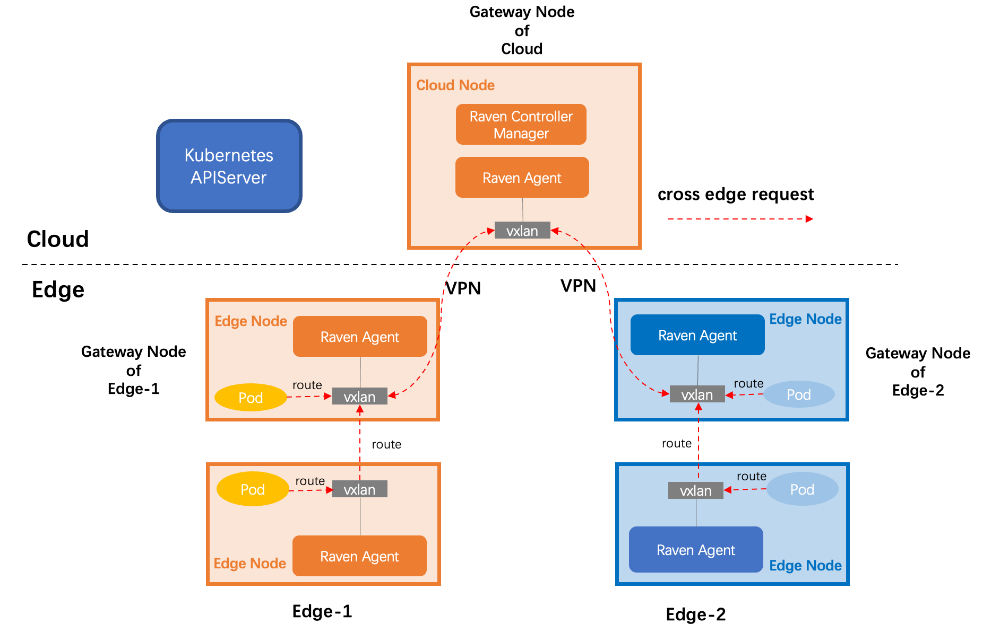

# Raven

Raven is component of the OpenYurt to enhance cluster networking capabilities. This enhancement is focused on edge-edge and edge-cloud communication in OpenYurt. In short, it will provide layer 3 network connectivity among pods in different physical regions, as there are in one vanilla Kubernetes cluster.

## Architecture

 

The above figure demonstrates the core Raven architecture. The major components consist of:

- **Raven Controller Manager**: It is a standard k8s controller that enhances cluster networking capabilities in edge computing. For examples, electing a `gateway` node for each edge base on node conditions.
- **Raven Agent**: A node daemon that serves as a proxy for the traffic of edge-cloud and edge-edge communication. It dynamically configures routing information or VPN connections on each node, according to the node role (`normal` node or `gateway` node).

## Getting Start

For a complete example, please check out the [tutorial](docs/raven-agent-tutorial.md).

## Contributing

Contributions are welcome, whether by creating new issues or pull requests. See our [contributing document](https://github.com/openyurtio/openyurt/blob/master/CONTRIBUTING.md) to get started.

## Contact

- Mailing List: openyurt@googlegroups.com
- Slack: [channel](https://join.slack.com/t/openyurt/shared_invite/zt-iw2lvjzm-MxLcBHWm01y1t2fiTD15Gw)
- Dingtalk Group (钉钉讨论群)

    

## License

Raven is under the Apache 2.0 license. See the [LICENSE](LICENSE) file for details. Certain implementations in Raven rely on the existing code from [Kubernetes](https://github.com/kubernetes/kubernetes) the credits go to the original authors.
